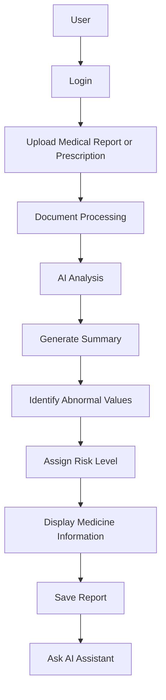
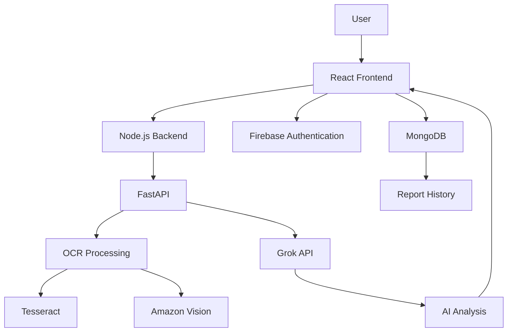
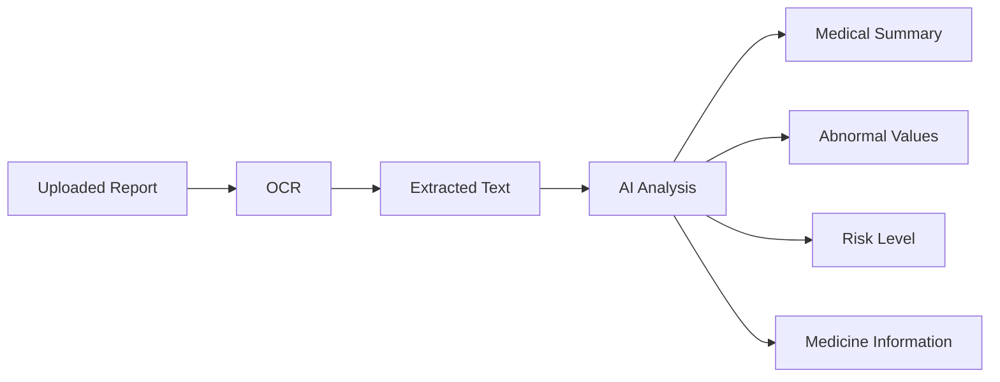

# MediLens

### AI-Powered Medical Report and Prescription Analyser

MediLens is a hackathon project that uses artificial intelligence to help users understand medical reports and prescriptions. The application analyses uploaded medical documents, extracts relevant information, and presents the results in a simpler and more accessible format.

The project combines AI-based document analysis with a web application to make medical information easier to understand.

## Features

* **Medical Report Analysis**
  Analyse uploaded medical reports using AI-powered processing.

* **Prescription Analysis**
  Extract and interpret information from medical prescriptions.

* **AI-Generated Summaries**
  Present medical information in a simplified format.

* **Abnormal Value Detection**
  Identify and highlight potentially abnormal test values.

* **Health Risk Tracking**
  Categorise report insights into Low, Moderate, and High risk levels.

* **Medicine Information**
  Display information about medicines mentioned in prescriptions.

* **AI Assistant Chatbot**
  Allow users to ask questions about their medical reports.

* **Voice Playback**
  Provide voice-based playback of report summaries.

* **User Authentication**
  Support user authentication through Firebase.

* **Report History**
  Allow users to save and review previously analysed reports.

## Application Workflow



## System Architecture



## Report Analysis Pipeline



## Tech Stack

| Technology        | Purpose                     |
| ----------------- | --------------------------- |
| **React**         | Frontend development        |
| **Stitch**        | UI development              |
| **JavaScript**    | Application development     |
| **Node.js**       | Backend development         |
| **FastAPI**       | API development             |
| **Grok API**      | AI-powered medical analysis |
| **Tesseract**     | OCR and text extraction     |
| **Amazon Vision** | Image and document analysis |
| **Firebase**      | User authentication         |
| **MongoDB**       | Database management         |

## Project Structure

```text
MediLens/
│
├── frontend/
│   └── React application
│
├── backend/
│   ├── Node.js
│   └── FastAPI
│
├── README.md
└── .gitignore
```

## Getting Started

### Prerequisites

* Node.js
* Python
* Firebase account
* MongoDB
* Required API credentials

### Clone the Repository

```bash
git clone https://github.com/<your-username>/MediLens.git
cd MediLens
```

### Installation

Install the required dependencies for the frontend and backend.

```bash
npm install
```

```bash
pip install -r requirements.txt
```

### Environment Variables

Create a `.env` file and add the required API credentials and configuration values.

```env
GROK_API_KEY=your_api_key
FIREBASE_CONFIG=your_firebase_configuration
MONGODB_URI=your_mongodb_connection_string
```

**Do not commit API keys or sensitive credentials to GitHub.**

### Run the Application

The application is currently configured to run locally.

```bash
npm run dev
```

> Backend startup commands and environment configuration may vary depending on the project setup.

## Usage

1. Sign in to the application.
2. Upload a medical report or prescription.
3. Allow the application to process the document.
4. Review the generated summary and extracted information.
5. Check potentially abnormal values and the assigned risk level.
6. View available medicine information.
7. Ask questions through the AI assistant.
8. Access previously saved reports.

## Business Model

MediLens follows a freemium business model.

### Free Plan

Provides access to essential report analysis and basic AI-generated insights.

### Premium Plan

Can include advanced analysis, additional tracking features, and enhanced AI assistant capabilities.

### Healthcare Partnerships

The application can support partnerships with online medicine brands and pharmacies through relevant advertisements or medicine-ordering integrations.

## Future Scope

* Multilingual medical report explanations
* Camera-based document scanning
* Advanced health tracking and analytics
* Doctor consultation integration
* Downloadable report summaries
* Enhanced privacy and data protection

## Disclaimer

MediLens is intended for educational and informational purposes only. It is not a substitute for professional medical advice, diagnosis, or treatment.

Users should consult a qualified healthcare professional before making medical decisions based on the information provided by the application.

## Project Status

MediLens is a hackathon project currently running locally. The application is not deployed.

## License

This project is intended for educational and development purposes.
